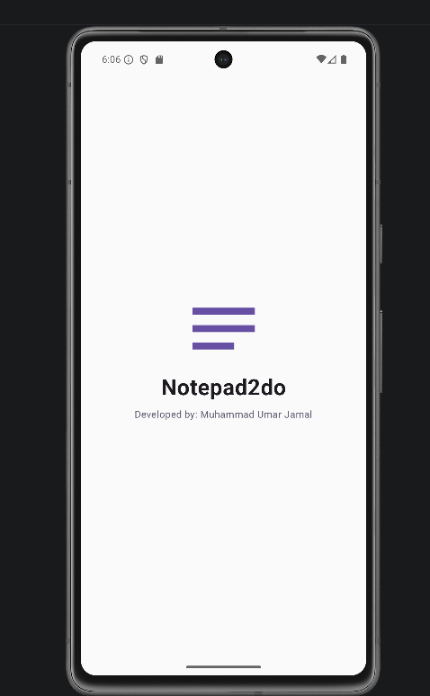
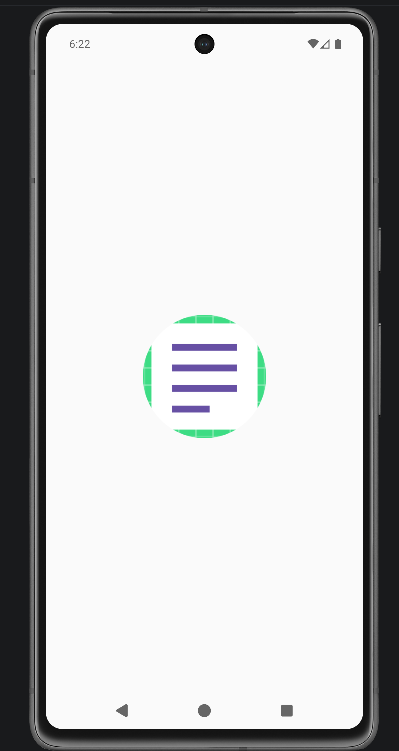
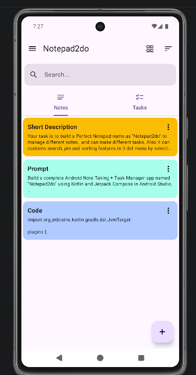
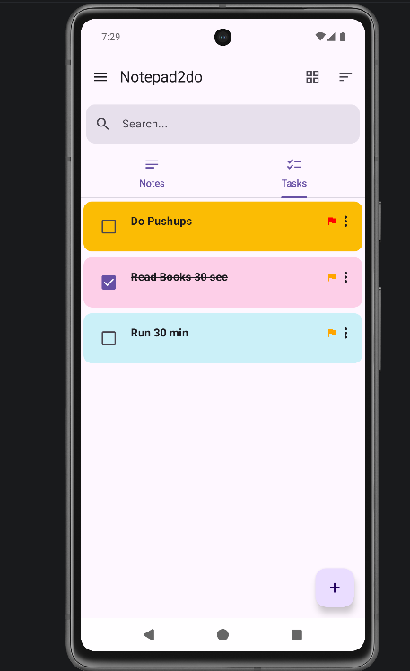
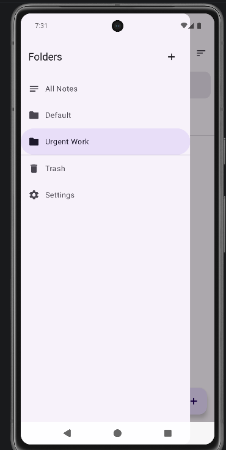

# Notepad 2 Do 📝


**Notepad 2 Do** is a modern, lightweight, and intuitive Android app designed for seamless note-taking and task management. Built with **Kotlin** and **Jetpack Compose**, it offers clean organization through custom folders, color-coded priorities, instant keyword search, and flexible view layouts.

---

## 📱 Screenshots

<div align="center">

| Splash Screen | Custom Icon | Notes List | To-Do Checklist | Folders |
| :-: | :-: | :-: | :-: | :-: |
|  |  |  |  |  |

<br/>

| Priority Setup | Quick Search | Sort Options | View Toggle | Dark Mode |
| :-: | :-: | :-: | :-: | :-: |
|  |  |  |  |  |

</div>

---

## ✨ Features

* 📝 **Notes & To-Dos:** Create detailed markdown notes or actionable checklists side by side.
* 📁 **Folder Organization:** Group notes and tasks into customizable folders for work, personal ideas, or projects.
* 🎯 **Priority Customization:** Assign priority levels (Low, Medium, High) with custom color pickers.
* 🔍 **Instant Search:** Real-time keyword search across all stored notes and tasks.
* ↕️ **Smart Sorting:** Dynamically sort entries by creation date, title, or priority level.
* 🔲 **Flexible Views:** Switch seamlessly between List View and Grid View layouts.
* 🌙 **Dark Mode & Themes:** Built-in Light/Dark mode with custom accent color settings.
* 🗑️ **Trash Management:** Safely restore accidentally deleted notes or permanently clear them.

---

## 🛠️ Tech Stack & Architecture

- **Language:** Kotlin
- **UI Framework:** Jetpack Compose (Declarative UI)
- **Architecture:** MVVM (Model-View-ViewModel) + Repository Pattern
- **Local Database:** Room Persistence Library
- **Preferences:** DataStore / SharedPreferences
- **Build System:** Gradle Version Catalogs (`libs.versions.toml`)

---

## 📂 Project Structure

```text
com.craftxcode.notepad2do/
├── data/
│   ├── local/          # Room Database, DAOs (Note, Task, Folder), Converters
│   ├── model/          # Data models (Note, Task, Folder, AppSettings)
│   ├── repository/     # App repository implementations
│   └── settings/       # Datastore settings manager
├── ui/
│   ├── components/     # Custom Jetpack Compose components (SearchBar, ColorPicker, etc.)
│   ├── navigation/     # App navigation graph & screen routes
│   ├── screens/        # App screens (Home, NoteEdit, TaskEdit, Settings, Trash, Splash)
│   ├── theme/          # Color schemes, typography, and Material 3 theme definitions
│   └── viewmodel/      # State management ViewModels
└── NotepadApplication.kt

```

---

## 🚀 Getting Started

### Prerequisites

* **Android Studio:** Jellyfish (2023.3.1) or newer
* **JDK:** 17 or higher
* **Android SDK:** Min SDK 24 (Android 7.0 Nougat)

### Installation

1. **Clone the repository:**
```bash
git clone [https://github.com/MUdevelops/Notepad2do-Android.git](https://github.com/MUdevelops/Notepad2do-Android.git)

```


2. **Open in Android Studio:**
* Launch Android Studio.
* Select **Open** and choose the `Notepad2do-Android` directory.


3. **Run the Application:**
* Allow Gradle Sync to finish.
* Select your target emulator or physical device and press **Run** (`Shift + F10`).


---

## 🤝 Contributing

Contributions are always welcome!

1. Fork the Project
2. Create your Feature Branch (`git checkout -b feature/AmazingFeature`)
3. Commit your Changes (`git commit -m 'Add some AmazingFeature'`)
4. Push to the Branch (`git push origin feature/AmazingFeature`)
5. Open a Pull Request

---

## 👤 Author

Developed by **[MUdevelops](https://www.google.com/search?q=https://github.com/MUdevelops)**.

---

## 📄 License

This project is licensed under the MIT License - see the [LICENSE](https://www.google.com/search?q=LICENSE) file for details.

